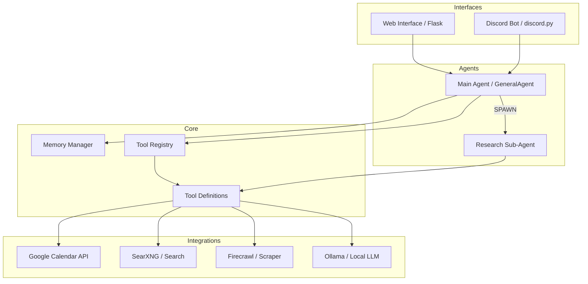

# Architecture Overview

CalGuy (**Brolympus Bot**) is a modular AI assistant designed to manage calendars and perform deep web research using local and cloud-based tools. 

## High-Level System Design

The system is divided into four main layers: **Interfaces**, **Agents**, **Core Logic**, and **External Integrations**.

---

## 1. Layers

### Interfaces
*   **Web Interface**: A Flask-based dashboard that uses Server-Sent Events (SSE) to stream agent thoughts, tool calls, and research logs in real-time.
*   **Discord Integration**: A bridge that allows the bot to interact within Discord channels, maintaining separate conversation states for different users/channels.

### Agents
*   **Main Agent (`GeneralAgent`)**: The central brain. It handles the dynamic system prompt, manages conversation history via the `MemoryManager`, and orchestrates tool calls.
*   **Research Sub-Agent (`ResearchAgent`)**: A specialized, ephemeral agent spawned for multi-step investigations. It operates in a restricted scope with its own internal thought loop.

### Core Logic
*   **Memory Manager**: Tracks conversation history, estimates token usage, and performs automatic history compression and briefing.
*   **Tool Registry**: A decorator-based system for registering and executing tools, ensuring that the assistant has access to correctly formatted JSON schemas for tool calling.

### External Integrations
*   **Google Calendar**: Handles event listing, creation, and deletion via OAuth2.
*   **Search Stack**: A combination of **SearXNG** (aggregation), **Firecrawl** (scraping), and **Ollama** (summarization).

---

## 2. Key Data Flows

### The "Thought-Tool-Result" Loop
1.  The User sends a message.
2.  The Main Agent generates a "thought" and potentially a "tool call."
3.  The interface captures these events and displays them (e.g., in the thinking drawer).
4.  The tool is executed server-side.
5.  The result is fed back into the agent's memory for the final response.

### Sub-Agent Spawning
When a complex research question is asked, the Main Agent uses the `investigate_topic` tool. This doesn't return text; instead, it returns a `SPAWN_SUBAGENT` signal. The system then pauses the main loop to run the `ResearchAgent`'s loop, streaming all sub-agent events back to the UI.
