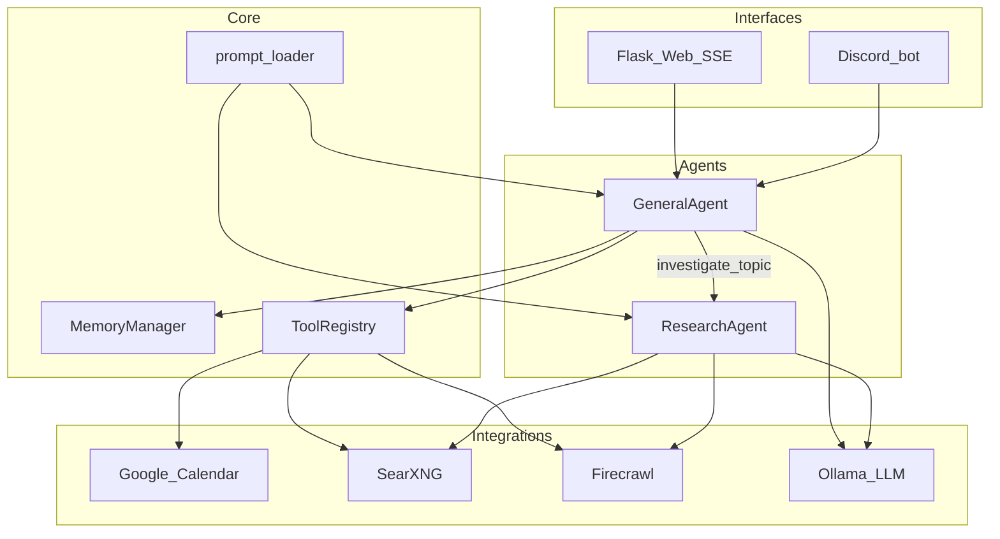

# Brolympus Bot — Technical Project Report

> **Also referenced in-repo as “CalGuy.”** This document describes the codebase as of the repository state used to author this report.

---

## Project Overview

**Brolympus Bot** is a personal, locally oriented AI assistant that combines **natural-language calendar management** (Google Calendar) with **optional web research** (search and structured scraping) powered by a **local large language model** via **Ollama**. It exposes two primary interfaces: a **Flask web UI** with **Server-Sent Events (SSE)** streaming, and a **Discord bot** with per-channel conversation state and persistence.

**Problem it addresses:** Scheduling and light research workflows often span quick chat interactions, calendar APIs, and the open web. Brolympus Bot centralizes those actions behind a single agent that can call tools (list/create/delete events, verify dates, search, scrape, deep-research) while keeping the LLM **on-machine** for privacy and cost control.

**Target audience:** Individual operators and small teams comfortable self-hosting Ollama and optional companion services (SearXNG, Firecrawl), plus Discord communities that want a **mention-driven** calendar-aware bot without shipping conversation data to a proprietary model API.

---

## Core Features

### Calendar and time reasoning

- **List upcoming events** via Google Calendar API (`list_upcoming_events`).
- **Create and delete events** with ISO 8601 times interpreted in a configured timezone (`SERVER_TIMEZONE`).
- **`verify_date` tool** — explicit day-of-week verification before creating events to reduce model hallucination on dates.

### Web discovery (optional)

- **`search_web`** — queries a configurable **SearXNG** instance; returns formatted titles, URLs, and snippets.
- **`scrape_url`** (feature-flagged) — uses **Firecrawl** to obtain markdown, then optionally **summarizes** against a query using Ollama (`ENABLE_WEB_SCRAPING`).

### Deep research (optional)

- **`investigate_topic`** (feature-flagged) — does not return text directly; returns a **`SPAWN_SUBAGENT`** signal so the main loop runs a dedicated **`ResearchAgent`** with a bounded tool loop (`ENABLE_DEEP_RESEARCH`).
- Sub-agent uses **`search_web`** and **`scrape_url`** with streaming “thought” and debug-style events surfaced to the UI.

### Interfaces

- **Web UI** — `POST /api/chat` streams JSON events over SSE (status, stream chunks, tool calls/results, compression, sub-agent events, errors). Supports **vision**: base64 images from the client decoded server-side.
- **Discord** — responds on **bot mention** or in **DMs**; **`!`-prefixed commands** for session control; downloads image attachments for vision (MIME/extension validation, cap on images per message).
- **CLI harness** — `python src/agents/agent.py` runs an interactive async loop for local testing (prints tool flow to the terminal).

### Session and memory behavior

- **Token estimation** (~4 chars per token, plus per-image heuristic) for budgeting.
- **Tool result pruning** — large tool payloads truncated before entering context; higher limits for research/scrape tool names.
- **Automatic history compression** — when estimated tokens cross ~80% of `OLLAMA_NUM_CTX`, older turns are summarized into a **`is_memory` system block**, preserving the most recent raw messages.
- **Context brief** — before spawning the research sub-agent, recent transcript tail is summarized for injection into the sub-agent system prompt.

### Discord-specific reliability

- **Per-channel `GeneralAgent` + `asyncio.Lock`** to serialize concurrent requests in the same channel.
- **JSON session persistence** under `data/sessions/<channel_id>.json` with **TTL cleanup** and **image pruning** on save (keeps only the most recent N user turns with images on disk).
- **Message chunking** — assistant output split to respect Discord’s **2000-character** limit with newline/whitespace-aware breaks.

### Unique selling points

- **Local-first LLM** with structured **Ollama tool calling**, plus a **regex “safety net”** for models that leak XML-style tool call syntax instead of native tool calls.
- **Composable optional stack**: calendar-only by default; search/scrape/research enabled via environment flags.
- **Transparent operation** — rich event stream (tool calls, compression, sub-agent progress) suitable for a “thinking” style UI.

---

## Tech Stack

| Layer | Technology | Rationale |
|--------|------------|-----------|
| Language | **Python 3.12+** (per README) | Strong async ecosystem, rapid iteration, excellent Google API client libraries. |
| LLM runtime | **Ollama** (`ollama` Python client, async) | Runs models locally; avoids per-token cloud API cost and keeps prompts/tool results on the operator’s hardware. |
| Web framework | **Flask** + **flask-cors** | Lightweight server for templates, REST-ish JSON, and SSE without a heavy JS build for the backend. |
| Real-time web | **SSE** (`text/event-stream`) | One-way server→client streaming fits assistant token and event flow; simpler than WebSockets for this use case. |
| Chat platform | **discord.py**, **aiohttp** | Mature Discord integration; aiohttp for efficient attachment downloads. |
| Calendar | **Google Calendar API** via `google-api-python-client`, **OAuth** (`google-auth-oauthlib`, `google-auth-httplib2`) | Industry-standard scheduling backend with user-delegated access. |
| HTTP | **requests** (sync in thread pool where used) | Straightforward blocking calls wrapped with `asyncio.to_thread` where needed. |
| Config | **python-dotenv** | Twelve-factor style configuration for keys, URLs, and feature flags. |
| Search | **SearXNG** (self-hosted) | Aggregated search with JSON output; operator controls engines and privacy posture. |
| Scraping | **Firecrawl** (self-hosted or cloud) | Converts pages to markdown for LLM-friendly consumption; optional API key for hosted mode. |
| Frontend (web) | **Jinja templates** + **static JS** (`src/web/static/js/app.js`) | Minimal client to consume SSE and render chat. |
| Testing | **pytest**-style tests under `tests/` | Regression coverage for chunking, memory, registry, etc. |

**Dependencies** are declared in [`requirements.txt`](../requirements.txt) (e.g. `ollama`, `flask`, `discord.py`, Google auth clients, `requests`, `aiohttp`).

---

## System Architecture

Brolympus Bot follows a **layered monolith** (single Python process per mode: `web` or `bot`), not microservices for the app itself. Optional **external services** (Ollama, SearXNG, Firecrawl) run separately and are reached over HTTP.



### Design patterns and structure

- **Agent + tool loop:** `GeneralAgent.chat_step` implements an async **thought → tool call → tool result** loop against Ollama with streaming, capped by a high `MAX_TURNS` guard.
- **Tool registry:** Decorator-based registration in [`src/core/tools.py`](../src/core/tools.py) builds JSON schemas for Ollama and dispatches execution through [`src/core/tool_registry.py`](../src/core/tool_registry.py).
- **Strategy-style feature flags:** Optional tools (`scrape_url`, `investigate_topic`) are registered only when env flags are true, keeping prompts and schemas aligned with deployment capability.
- **Sub-agent pattern:** Research is an **ephemeral agent** with its own message list and tighter turn limit, spawned synchronously within the main agent’s tool execution path and **folded back** as the parent tool’s string result.
- **MVC-ish web split:** Flask routes + Jinja views + static assets; “controller” logic largely lives in route handlers calling into the agent.

### Notable structural detail

- **Discord:** one `GeneralAgent` (and lock) **per channel** with disk-backed history.
- **Web:** a **single global** `GeneralAgent` in [`src/web/app.py`](../src/web/app.py) — suitable for a single operator browser session, not multi-tenant isolation.

---

## Technical Challenges and Solutions

### 1. Ollama tool calling inconsistency (XML leakage)

**Challenge:** Some models emit pseudo-XML tool calls in plain content instead of structured `tool_calls`, breaking the execution loop.

**Solution:** In [`src/agents/agent.py`](../src/agents/agent.py), after streaming assembly, a **regex safety net** detects `<function=...>` / `<parameter=...>` patterns, reconstructs a synthetic `tool_calls` structure, and **strips** the XML from assistant memory to avoid polluting future turns.

### 2. Bridging async agent core to Flask’s synchronous WSGI model

**Challenge:** `GeneralAgent.chat_step` is an **async generator**; Flask route handlers are synchronous by default.

**Solution:** [`src/web/app.py`](../src/web/app.py) creates a **fresh event loop** per SSE request, drives `loop.run_until_complete(gen.__anext__())` in a `while True` / `StopAsyncIteration` pattern, and **closes** the loop in `finally`. This isolates concurrent requests at the cost of per-request loop overhead.

### 3. Unbounded context from tool payloads

**Challenge:** Calendar listings or scrape dumps can exhaust the context window.

**Solution:** [`src/core/memory_manager.py`](../src/core/memory_manager.py) applies **character limits** to tool results before append, with **elevated limits** for research/scrape tool names; combines with **async compression** that summarizes older non-system messages into a memory summary block while preserving a **minimum tail** of raw messages.

### 4. Multi-step research without blocking the UX

**Challenge:** Research requires multiple network and LLM steps.

**Solution:** `ResearchAgent.research_loop` is an **async generator** yielding granular events; the main agent forwards sub-agent streams and debug callbacks so the **web client** can render progress in real time. A **context brief** is generated from recent history to ground the sub-agent.

### 5. Discord concurrency, persistence, and limits

**Challenge:** Concurrent messages in one channel, session continuity across restarts, large vision payloads, and Discord’s **2000-character** cap.

**Solution:** Per-channel **asyncio.Lock**; JSON persistence with **TTL cleanup**; **strip older base64 images** from stored history while keeping recent vision turns; [`src/bot/text_chunking.py`](../src/bot/text_chunking.py) splits long replies with intelligent break points.

### 6. Optional infrastructure coupling

**Challenge:** Search/scrape fail loudly if SearXNG/Firecrawl are down.

**Solution:** Integrations return **actionable error strings** (e.g. connection failures) so the model can explain next steps; feature flags allow **calendar-only** deployments.

---

## Setup and Installation

### Prerequisites

- **Python 3.12+**
- **Ollama** installed and running; pull a tool-capable model (see README / [`docs/infrastructure_setup.md`](infrastructure_setup.md)).
- **Google Cloud** project with Calendar API enabled and **OAuth desktop** client JSON.
- (Optional) **SearXNG**, **Firecrawl** per [`docs/infrastructure_setup.md`](infrastructure_setup.md).
- (For Discord mode) **Discord bot token** and application configured with required intents (including **message content** where applicable).

### Clone and install

```bash
git clone <your-repo-url> BrolympusBot
cd BrolympusBot
python -m venv .venv
source .venv/bin/activate   # Windows: .venv\Scripts\activate
pip install -r requirements.txt
```

### Environment variables

```bash
cp .env_example .env
```

Edit `.env` — key variables (see [`.env_example`](../.env_example)):

| Variable | Purpose |
|----------|---------|
| `CREDENTIALS_FILE` | Path to Google OAuth client JSON |
| `OLLAMA_MODEL` | Ollama model name |
| `OLLAMA_NUM_CTX` | Context length (e.g. `32768`) |
| `SERVER_TIMEZONE` | IANA timezone for calendar operations |
| `ENABLE_WEB_SCRAPING` | `true` / `false` |
| `ENABLE_DEEP_RESEARCH` | `true` / `false` |
| `DISCORD_TOKEN` | Bot token (Discord mode only) |
| `SEARXNG_URL` | Base URL for SearXNG |
| `FIRECRAWL_URL` / `FIRECRAWL_API_KEY` | Firecrawl endpoint and optional key |
| `PORT` | Web port (defaults to `5001` in `main.py` if unset) |

On first calendar use, complete the **OAuth browser flow**; the integration persists **`token.json`** for subsequent runs (behavior described in infrastructure docs).

### Run locally

**Web UI:**

```bash
python main.py web
```

Open `http://127.0.0.1:5001` (or `http://localhost:$PORT`).

**Discord bot:**

```bash
python main.py bot
```

**CLI agent harness:**

```bash
python src/agents/agent.py
```

> **Note:** Root [`README.md`](../README.md) still references legacy filenames (`python app.py`, `python agent.py`). The supported entry points are **`main.py`** and module paths under **`src/`** as used above.

---

## Future Roadmap (next six months)

1. **Documentation accuracy** — Align README run commands and file map with `main.py` and `src/` layout; add architecture diagram links.
2. **Web multi-session** — Per-browser-tab or per-user session agents (parity with Discord’s per-channel isolation).
3. **Production web serving** — Move from Flask’s built-in server to **gunicorn** / **uvicorn** + proper SSE worker tuning; add health checks.
4. **Skills surfacing** — [`src/core/skill_loader.py`](../src/core/skill_loader.py) exists; expose **`load_skill_summaries` / `get_skill_content`** as tools or prompt injections so packaged `skills/` content affects runtime behavior consistently.
5. **Auth and secrets** — Rotate logs, redact tokens in logs, optional **secret manager** integration for shared deployments.
6. **Observability** — Structured logging (JSON), correlation IDs across tool/sub-agent spans, basic metrics for tool latency and compression frequency.
7. **Testing and CI** — Expand integration tests (mock Ollama/Google), add GitHub Actions (lint + pytest) if not already present.
8. **Scaling strategies** — Horizontal scaling of **Discord shards** only where needed; keep **single-writer** calendar OAuth per user; consider **queue + worker** for long research jobs to avoid blocking channel locks.
9. **Hardening** — Rate limits on web API, attachment size caps, stricter content-type validation, and timeouts tuned per integration.

---

## Project Status

| Item | Status |
|------|--------|
| **Versioning** | No `pyproject.toml` / `__version__` semantic version found in-repo; treat as **rolling mainline** unless tags are added later. |
| **License** | **MIT** (see [`LICENSE`](../LICENSE), copyright 2026). |
| **Deployment** | **Self-hosted / local** — no first-party Dockerfile in repository; operators bring their own process manager (systemd, pm2, etc.) and optional Docker for SearXNG/Firecrawl. |
| **Known gaps / bugs** | **README drift** (wrong entry commands/paths); **web UI** uses one global agent (unexpected sharing if multiple users hit one instance); **`get_skill_content`** imported in tools module but **no registered tool** yet; **Flask dev-style** serving for production not recommended without a proper WSGI server. |
| **Tests** | Unit tests exist under `tests/` for chunking, memory, registry, compression, etc.; `tests/test_fail.py` is a **manual reproduction harness**, not necessarily a failing assertion test. |

---

## Appendix: Repository map (high level)

| Path | Role |
|------|------|
| `main.py` | CLI entry: `web` or `bot` mode |
| `src/agents/agent.py` | `GeneralAgent`, main Ollama loop, sub-agent orchestration |
| `src/agents/research_agent.py` | `ResearchAgent` bounded research loop |
| `src/core/tools.py` | Tool definitions and feature-flagged registration |
| `src/core/memory_manager.py` | Token estimate, prune, compress, brief |
| `src/web/app.py` | Flask + SSE API |
| `src/bot/discord_bot.py` | Discord commands, sessions, persistence |
| `src/integrations/` | Google Calendar, web search/scrape |
| `prompts/` | System and auxiliary prompts (loaded by `prompt_loader`) |
| `docs/` | Architecture, infrastructure, protocols |

---

*End of report.*
