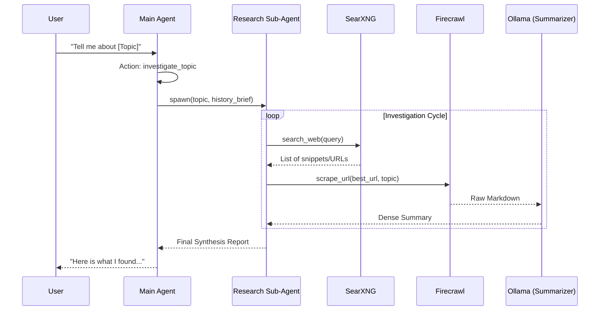

# Web Search & Research Workflow

This document outlines how the **CalGuy** system retrieves and synthesizes information from the web.

## 1. Tool Selection Logic

The main agent (Brolympus Bot) evaluates the user's request and chooses between three levels of investigation:

| Level | Tool | Best Used For |
| :--- | :--- | :--- |
| **Surface** | `search_web` | Quick facts, current headlines, or finding specific URLs. |
| **Deep** | `scrape_url` | Reading the full content of a specific page for detailed context. |
| **Comprehensive** | `investigate_topic` | Complex questions requiring multiple sources and a synthesized report. |

---

## 2. Technical Workflows

### Quick Search (`search_web`)
The `search_web` tool is the fastest method. It queries a local **SearXNG** instance.
1. **Request**: The agent provides a query.
2. **Aggregation**: SearXNG fetches results from engines like Google, Bing, and DuckDuckGo.
3. **Processing**: Results are formatted into a concise string containing titles, URLs, and snippets.
4. **LLM involvement**: No AI summarization happens at this stage. The result is passed directly to the calling agent to minimize latency and token usage.

### Detailed Scraping (`scrape_url`)
When the agent needs to "read" a page, it uses **Firecrawl**.
1. **Extraction**: Firecrawl crawls the URL and converts the page into clean Markdown.
2. **Summarization**: If a `query` is provided (standard for research), the raw Markdown is processed by a local **Ollama** model.
3. **Model**: An extraction-specialized prompt is used to pull only relevant facts, outputting a dense report (max 500 words).

### Deep Investigation (`investigate_topic`)
This tool spawns a **Research Sub-Agent**, creating a dedicated thought-loop for complex investigation.

1. **Context Briefing**: The `MemoryManager` generates a concise summary of the conversation history so far. This "Brief" is passed to the sub-agent.
2. **Looping**: The sub-agent runs for up to 6 turns. It can call `search_web` to find candidate URLs and `scrape_url` to read them.
3. **Synthesis**: After gathering data, the sub-agent writes a final, comprehensive factual report which is returned to the main agent.

---

## 3. Summarization Architecture

Summarization happens at specific "bottlenecks" to preserve context while keeping tool outputs manageable:

*   **Extraction Level**: Handled by `summarize_scrape` in `integrations/web_search.py` using a local LLM.
*   **Synthesis Level**: Handled by the `ResearchAgent` in `agents/research_agent.py`.
*   **Context Level**: Handled by `MemoryManager` when preparing data for the sub-agent.

---

## 4. Sequence Diagram

